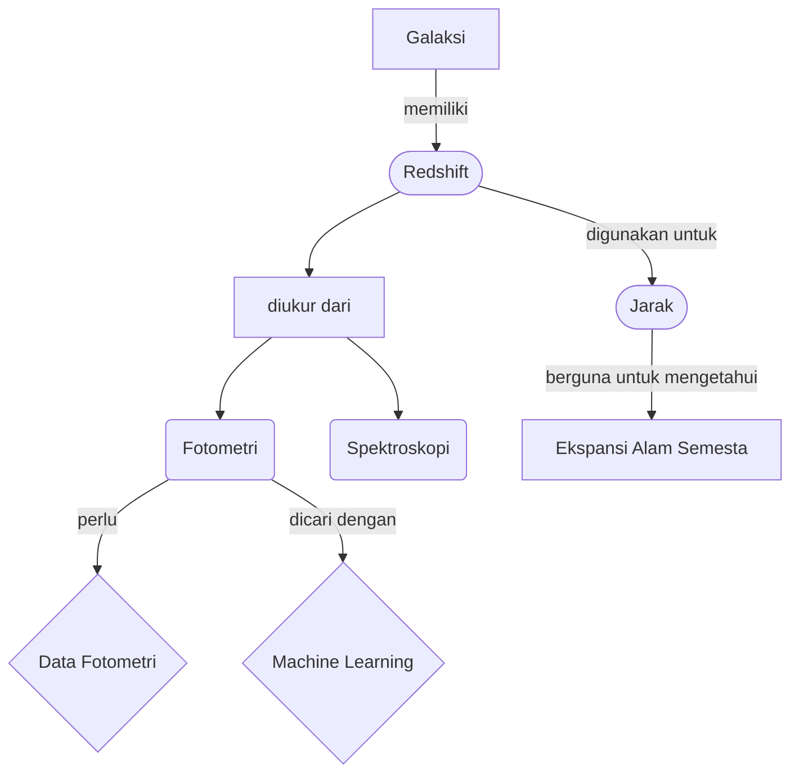

```mermaid
graph TB
%% nodes connections
G -- "memiliki" --> R
R -- "digunakan untuk" --> D
R --> ID
ID --> F
ID --> S
F --"perlu"--> DF
F --"dicari dengan"--> ML
D --"berguna untuk mengetahui"--> E

%% nodes definition
G[Galaksi]
R([Redshift])
D([Jarak])
ID["diukur dari"]
F(Fotometri)
S(Spektroskopi)
E[Ekspansi Alam Semesta]
ML{Machine Learning}
DF{Data Fotometri}
```
